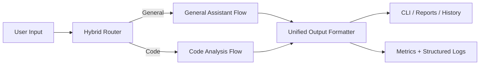
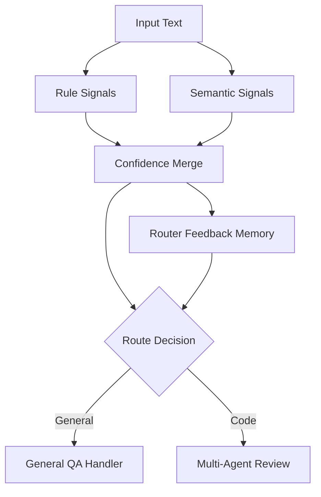
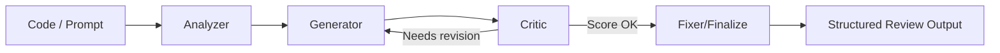

# TRX-AI

**Think. Reason. Execute.**

TRX-AI is a CLI-first, hybrid AI assistant for structured debugging, code review, and safe auto-fix workflows using local LLMs and resilient fallbacks.

Built for real engineering loops: fast intent routing, multi-agent review, structured output, observability, and deterministic runtime behavior.

---

## Why TRX

- `Hybrid intelligence`: Rule-first + semantic routing + feedback learning.
- `Engineering-first UX`: Built for terminal-native developer workflows.
- `Reliable by default`: Fallbacks, retries, cache TTL, and runtime status signals.
- `Actionable outputs`: Structured review sections, not vague chat blobs.
- `Showcase-ready`: Clean architecture, measurable behavior, and testable components.

---

## Feature Highlights

- ⚡ **Hybrid Intent Routing**: Route requests to general or code workflows with confidence signals.
- 🧠 **Multi-Agent Code Pipeline**: Analyzer, Generator, Critic, and Fixer stages.
- 🛡️ **Fallback Safety**: Graceful behavior when LLM or graph context is degraded.
- 📈 **Observability**: Structured logs, latency metrics, cache hit/miss, breaker state.
- 🗂️ **Session & Export Tools**: History, save/export, comparison reports.
- 🧪 **Smoke + Unit Testing**: `main.py test`, `smoke_e2e.py`, and CI-friendly assertions.

---

## How It Works

TRX receives user input, classifies intent, chooses the best execution path, then returns either conversational output or structured analysis with metadata.

1. Detect intent with rule + semantic signals.
2. Route to general assistant flow or code analysis flow.
3. Apply cache, fallback, and observability instrumentation.
4. Return output with runtime metadata (`mcp_query_status`, `circuit_breaker_state`, `cache_hit`).

---

## Architecture

### System Architecture Flow



### Intent Routing Pipeline



### Multi-Agent Pipeline



---

## CLI Demo

```bash
# Start TRX
python main.py

# Ask general questions
trx-ai > hi
trx-ai > what is data warehouse

# Review code
trx-ai > review dsa_test.py

# Generate fixed code
trx-ai > fix dsa_test.py

# Show runtime status
trx-ai > status

# Run built-in smoke summary
python main.py test

# Run machine-readable end-to-end smoke report
python smoke_e2e.py --disable-llm
```

---

## Commands

- `help` - Show available commands
- `history` - Show session inputs
- `save <path>` - Save session JSON
- `export <file>` - Export latest analysis report (`.txt` or `.pdf`)
- `export compare <file>` - Export comparison PDF from latest two analyses
- `agents all | agents debug improve predict` - Control active agents
- `mode debug|optimize|predict` - Set fallback profile
- `review <code_file | folder_path>` - Run multi-agent code review
- `fix <code_file>` - Generate fixed code and ask before saving
- `watch <folder>` - Auto-review changed code files
- `python main.py test` - Run TRX smoke test summary
- `python smoke_e2e.py --disable-llm` - Emit JSON pass/fail matrix report
- `exit | quit` - Close CLI

---

## Clean Output Example

```text
[TRX RESPONSE]

💬 Response:
Here’s the root cause: the login check does not validate empty tokens.

Insight:
Add a guard clause before parsing and return a typed auth error.

Confidence: High
Runtime:
- intent: code
- mcp_query_status: ACTIVE
- circuit_breaker_state: CLOSED
- cache_hit: false
```

---

## Reliability & Observability

- Rule-first routing with semantic enhancement
- Retry/backoff for local LLM calls
- Deterministic in-memory cache TTL
- Structured runtime events (`intent_route`, `response_runtime`)
- First-class breaker and MCP status in outputs
- Graceful degraded-mode fallbacks

---

## Evaluation & Testing

- Unit and smoke tests:

```bash
python -m pytest -q tests/test_trx_ai.py
python main.py test
python smoke_e2e.py --disable-llm --json-out sessions/smoke_e2e_report.json
```

- JSON smoke report includes:
- overall score out of 10
- category summaries
- pass/fail matrix per check

See:
- [docs/evaluation.md](docs/evaluation.md)
- [docs/architecture.md](docs/architecture.md)
- [docs/design.md](docs/design.md)

---

## Setup

1. Install dependencies:

```bash
pip install -r requirements.txt
```

2. Configure `.env`:

```env
RD_USE_LOCAL_LLM=true
LOCAL_LLM_URL=http://localhost:11434/api/generate
LOCAL_LLM_MODEL=qwen3:8b
HF_REQUEST_TIMEOUT=120
HF_MAX_NEW_TOKENS=600
HF_TEMPERATURE=0.3
RD_ASSISTANT_MODE=auto
RD_CACHE_SIZE=120
RD_CACHE_TTL_SECONDS=300
RD_DEBUG_CACHE=false
RD_REVIEW_LOGS=false
```

3. Run:

```bash
python main.py
```

---

## Project Structure

```text
chatcli/
|-- main.py
|-- analyzer.py
|-- formatter.py
|-- watcher.py
|-- history.py
|-- config.py
|-- evaluation.py
|-- semantic_scoring.py
|-- smoke_e2e.py
|-- tests/
|-- docs/
|-- assets/
|-- README.md
|-- LICENSE
```

---

## License

MIT - see [LICENSE](LICENSE).

