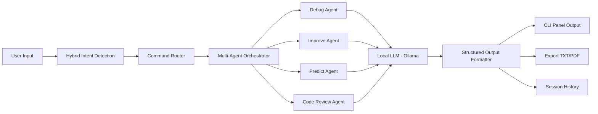

# TRX-AI - Multi-Agent Code Intelligence System

TRX-AI is a production-style, CLI-based AI system for structured reasoning, code review, and automated fixing workflows.  
It combines hybrid intent detection, multi-agent analysis, and local LLM inference to deliver clear, actionable outputs in terminal-first environments.

## Overview

TRX-AI is designed for fast engineering feedback loops:

- CLI-driven interaction for local development workflows
- Hybrid intent detection (rule-based priority + LLM fallback)
- Multi-agent reasoning pipeline (Debug, Improve, Predict, Code Review)
- Structured code review with categorized outputs
- Automatic fixed-code generation (`fix <file.py>`)
- Local LLM support via Ollama (`qwen3:8b` default)

## Features

- Structured debugging output:
  - `DEBUG`
  - `IMPROVEMENTS`
  - `PERFORMANCE`
  - `FIX`
  - `SUMMARY`
  - `CONFIDENCE`
- Code review engine for file/folder targets
- Auto-fix generation with safe write to `<name>_fixed.py`
- Real-time file watcher (`watch <folder>`) with debounce support
- Report export:
  - TXT reports
  - PDF reports
  - comparison PDF reports
- Evaluation and benchmarking module (`evaluation.py`)
- Baseline vs TRX comparison metrics

## Architecture

Pipeline:

`User Input -> Intent Detection -> Multi-Agent System -> LLM -> Structured Output`



## Demo

```bash
trx-ai > review dsa_test.py
trx-ai > fix formatter.py
python evaluation.py
```

## Visuals

### Architecture Graph


### CLI Screenshot - Review Output


### CLI Screenshot - Fix Output


Note: If screenshots are not present yet, add them under `assets/screenshots/`.

## Commands

- `help` - Show available commands
- `history` - Show session inputs
- `save [path]` - Save session JSON
- `export <file>` - Export latest analysis report
- `export compare [file]` - Export comparison report from latest two analyses
- `agents all | agents debug improve predict` - Enable/disable agents
- `mode debug|optimize|predict` - Set fallback profile
- `review <file.py | folder_path>` - Run code review
- `fix <file.py>` - Generate fixed file and optionally save
- `watch <folder>` - Auto-review `.py` file changes
- `exit` - Quit CLI

## Evaluation and Benchmarking

TRX-AI includes a complete evaluation module in `evaluation.py`.

It measures:

- `accuracy_score` - Expected issue match rate
- `fix_quality_score` - Expected fix suggestion match rate
- `avg_response_time_seconds` - Average response latency
- `completeness_score` - Section fill quality (`debug/improve/performance`)
- Baseline comparison vs simple LLM prompt

Run:

```bash
python evaluation.py
```

Output:

- terminal benchmark summary
- `evaluation_report.txt`

## Setup

1. Create virtual environment and install dependencies:

```bash
pip install -r requirements.txt
```

2. Configure `.env`:

```env
RD_USE_LOCAL_LLM=true
LOCAL_LLM_URL=http://localhost:11434/api/generate
LOCAL_LLM_MODEL=qwen3:8b
HF_REQUEST_TIMEOUT=120
HF_MAX_NEW_TOKENS=600
HF_TEMPERATURE=0.3
```

3. Start TRX-AI:

```bash
python main.py
```

## Project Structure

```text
chatcli/
|-- main.py
|-- analyzer.py
|-- formatter.py
|-- watcher.py
|-- history.py
|-- config.py
|-- evaluation.py
|-- dsa_test.py
|-- README.md
```

## Why TRX-AI

TRX-AI is built to feel like a lightweight, local-first coding intelligence assistant:

- deterministic where needed (rules)
- adaptive where needed (LLM)
- structured for readability
- practical for real development workflows

## License

MIT (add `LICENSE` file if not present).
