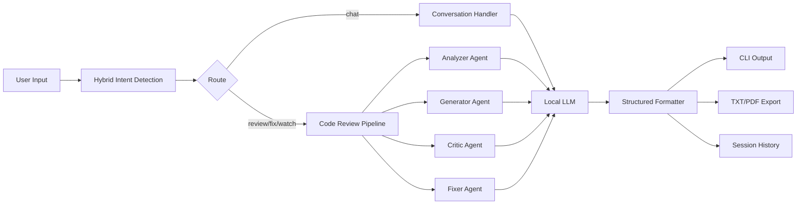

# TRX-AI - Multi-Agent Code Intelligence System

TRX-AI is a CLI-first AI assistant for structured debugging, code review, and auto-fix workflows using a local LLM.

## Overview

TRX-AI is designed for practical engineering loops in terminal environments:

- Hybrid intent detection (rule priority + LLM fallback)
- Multi-agent reasoning (Debug, Improve, Predict, Review)
- Structured review output (`DEBUG`, `IMPROVEMENTS`, `PERFORMANCE`, `FIX`, `SUMMARY`, `CONFIDENCE`)
- Auto-fix generation to safe output files (`<name>_fixed.py`)
- Session history and TXT/PDF export

## Architecture

Pipeline:

`User Input -> Intent Detection -> Agent Orchestrator -> Local LLM -> Structured Output -> CLI/Reports`



Detailed docs:

- [docs/architecture.md](docs/architecture.md)
- [docs/design.md](docs/design.md)
- [docs/evaluation.md](docs/evaluation.md)

## Demo

```bash
trx-ai > review dsa_test.py
trx-ai > fix dsa_test.py
python evaluation.py
```

## Commands

- `help` - Show available commands
- `history` - Show session inputs
- `save <path>` - Save session JSON
- `export <file>` - Export latest analysis report (`.txt` or `.pdf`)
- `export compare <file>` - Export comparison PDF from latest two analyses
- `agents all | agents debug improve predict` - Control active agents
- `mode debug|optimize|predict` - Set fallback profile
- `review <code_file | folder_path>` - Run multi-agent code review
- `fix <code_file>` - Generate fixed code and ask before saving
- `watch <folder>` - Auto-review changed code files (`.py/.js/.ts/.java/.c/.cpp/.cs/.go/.rs/.swift/.kt/.php/.sql/.rb`)
- `exit | quit` - Close CLI

## Output Format

TRX-AI returns structured sections for analysis responses:

- `DEBUG`
- `IMPROVEMENTS`
- `PERFORMANCE`
- `FIX`
- `SUMMARY`
- `CONFIDENCE`

System metadata is also shown (`intent`, `source`, and status tags).

## Multi-Agent Roles

- Analyzer Agent: identifies core bugs and edge cases
- Generator Agent: proposes code-level improvements
- Critic Agent: validates quality and catches weak outputs
- Fixer Agent: produces final corrected code (safe write to `_fixed` file)

## Reliability

- Rule-first intent routing with LLM fallback
- Retry/backoff for local LLM calls
- Truncation handling for long model outputs
- Fallback analysis when model is unavailable
- Safe fix flow with preview + confirmation

## Evaluation

Evaluation is available in `evaluation.py` with benchmark-style metrics:

- Accuracy
- Fix Quality
- Avg Response Time
- Completeness
- Baseline comparison

Run:

```bash
python evaluation.py
```

## Setup

1. Install dependencies:

```bash
pip install -r requirements.txt
```

2. Configure `.env`:

```env
RD_USE_LOCAL_LLM=true
LOCAL_LLM_URL=http://localhost:11434/api/generate
LOCAL_LLM_MODEL=qwen3:8b
HF_REQUEST_TIMEOUT=120
HF_MAX_NEW_TOKENS=600
HF_TEMPERATURE=0.3
RD_REVIEW_LOGS=false
```

3. Start:

```bash
python main.py
```

## Quick Workflows

```bash
# Chat
trx-ai > hi

# Review a single file
trx-ai > review main.py

# Generate fixed code with preview
trx-ai > fix dsa_test.py

# Export latest run
trx-ai > export report.pdf

# Compare latest two analyses
trx-ai > export compare comparison_report.pdf
```

## Project Structure

```text
chatcli/
|-- main.py
|-- analyzer.py
|-- formatter.py
|-- watcher.py
|-- history.py
|-- config.py
|-- evaluation.py
|-- tests/
|-- docs/
|-- assets/
|-- README.md
|-- LICENSE
```

## License

MIT - see [LICENSE](LICENSE).
